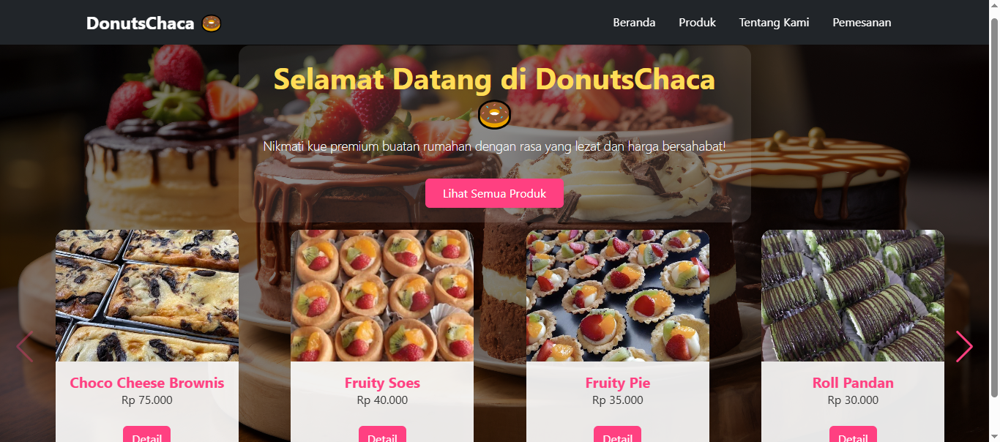

# 🍩 Donutschaca – Web-Based Donut Ordering System  

<p align="center">
  
</p>

<p align="center">
  <b>Web Application for UMKM Donut Ordering</b><br>
  Built with PHP Native, MySQL & Bootstrap
</p>

<p align="center">
  
  
  
  
</p>

---

## 🚀 About The Project  

**Donutschaca** adalah aplikasi pemesanan donat berbasis web yang dikembangkan untuk membantu **UMKM Donutschaca** dalam mengelola proses bisnis secara digital, mulai dari **manajemen produk, pemesanan, pembayaran, hingga laporan penjualan**.

Aplikasi ini dibangun menggunakan **PHP Native** tanpa framework backend untuk memperkuat pemahaman logika pemrograman dan struktur sistem informasi berbasis web.

---

## 👥 User Roles & Features  

### 👨‍💼 Admin  
<p align="center">
  
</p>

- Mengelola data produk  
- Mengelola pemesanan pelanggan  
- Mengelola pembayaran  
- Melihat bukti pembayaran  
- Melihat riwayat pemesanan  

---

### 👑 Owner  
<p align="center">
  
</p>

- Melihat laporan produk  
- Melihat laporan pemesanan  
- Melihat laporan pembayaran  
- Melihat pendapatan penjualan  
- Mengelola akun admin  

---

### 🧑‍💻 Pelanggan  
<p align="center">
  
</p>

- Melihat daftar produk  
- Melakukan pemesanan produk  

---

## 🛠️ Tech Stack  

<p align="center">
  
</p>

- Backend : PHP Native  
- Frontend : HTML, CSS, JavaScript  
- UI Framework : Bootstrap  
- Database : MySQL  
- Server : Apache (XAMPP)  

---

## 📁 Project Structure  

```bash
htdocs/
├── admin/
├── owner/
├── pelanggan/
├── koneksi/
├── bukti/
├── img/
├── donut.png
└── index.php

--- ## ⚙️ Instalasi & Konfigurasi
1. **Clone repository**

bash
git clone https://github.com/username/donutschaca.git

2. **Pindahkan project ke folder htdocs**
bash
C:/xampp/htdocs/donutschaca

3. **Buat database MySQL**
* Nama database: donutschaca
* Import file SQL (jika tersedia)

4. **Konfigurasi koneksi database**
Buka file:

bash
/koneksi/koneksi.php

Sesuaikan dengan konfigurasi MySQL Anda:
php
$host = "localhost";
$user = "root";
$pass = "";
$db   = "donutschaca";

5. **Jalankan aplikasi**
Buka browser dan akses:
text
http://localhost/donutschaca
---

🔐 Access Control
| Role      | Access                      |
| --------- | --------------------------- |
| Admin     | Produk, Pesanan, Pembayaran |
| Owner     | Laporan & Manajemen Admin   |
| Pelanggan | Produk & Pemesanan          |

🎓 Academic Context
Project ini dikembangkan sebagai bagian dari skripsi / tugas akhir dan implementasi Sistem Informasi UMKM berbasis web.

👨‍🎓 Developer
Muhamad Dimas Ramdani Fitrian Syaputra
Informatics Engineering Student – Web Development

“Building systems is not just about code, but about solving real problems.”

⭐ If you find this project useful, please give it a star!
